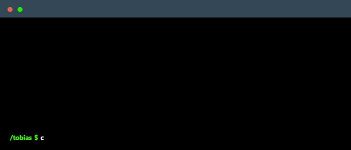

# Hey there, I'm Tobias 👋

## Programming Languages

## Databases

Qdrant and Firestore too but they don't have logos on SkillIcons yet :(

## Tools

n8n, Jira and Render too :)

## Connect with me!

    
    

